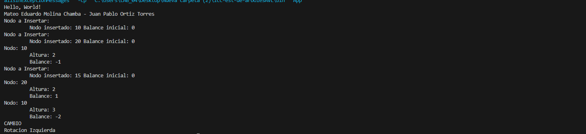

# Árbol Binario de Búsqueda - Práctica de Estructuras No Lineales

## 📌 Información General

- **Título:** Implementación de Árboles AVL
- **Asignatura:** Estructura de Datos
- **Carrera:** Computación
- **Estudiante:** Mateo Molina - Juan Pablo Ortiz
- **Fecha:** 26/06/2025
- **Profesor:** Ing. Pablo Torres

---

## 🛠️ Descripción

Este proyecto implementa un Árbol Binario de Búsqueda (ABB) en Java, permitiendo:

- Insertar nodos en el árbol.
- Calcular el peso (cantidad de nodos) y la altura del árbol.
- Imprimir el árbol en recorrido inorden, mostrando también la altura y el factor de equilibrio de cada nodo.
- Verificar si el árbol está equilibrado.
- Agregar nodos manualmente.
- Identificar e imprimir los nodos desequilibrados.

La lógica principal se encuentra en [`materia.controllers.ArbolBinario`](src/materia/controllers/ArbolBinario.java) y los nodos están definidos en [`materia.models.Nodo`](src/materia/models/Nodo.java).

---

## 🚀 Ejecución

Para compilar y ejecutar el proyecto desde la terminal:

```sh
javac -d bin src/App.java src/materia/controllers/ArbolBinario.java src/materia/models/Nodo.java
java -cp bin App
```

---

## 🧑‍💻 Ejemplo de Salida





```plaintext
Mateo Eduardo Molina Chamba - Juan Pablo Ortiz Torres
Nodo a Insertar:
         Nodo insertado: 10 Balance inicial: 0
Nodo a Insertar:
         Nodo insertado: 20 Balance inicial: 0
Nodo: 10
         Altura: 2
         Balance: -1
Nodo a Insertar:
         Nodo insertado: 15 Balance inicial: 0
Nodo: 20
         Altura: 2
         Balance: 1
Nodo: 10
         Altura: 3
         Balance: -2
CAMBIO
Rotacion Izquierda
```

---

## 📂 Estructura del Proyecto

```
src/
  App.java
  materia/
    controllers/
      ArbolBinario.java
    models/
      Nodo.java
```

---

## 📄 Notas

- El proyecto está configurado para usar la carpeta `src` como fuente y `bin` como salida de compilación.
- No requiere librerías externas.
- Puedes modificar los valores insertados en el árbol editando el método `main` en [`App`](src/App.java).

---